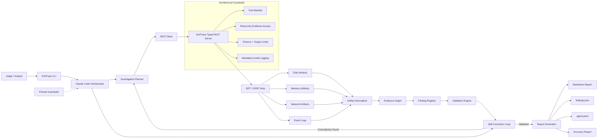

# EvilTrace Architecture

EvilTrace is built around a strict separation between autonomous reasoning and forensic evidence access.

## Architectural Guardrails

- Typed MCP functions expose case, evidence, PCAP, disk, Windows, memory, graph, finding, and validation operations.
- Evidence paths are read-only by policy.
- Writes are restricted to `artifacts/` and `docs/`.
- Command execution is allowlisted and denied-pattern checked.
- Tool calls have timeout and output-size limits.
- Every tool call emits JSONL audit events and raw output hashes.

## Prompt Guardrails

- The investigator prompt forbids guessing and overclaiming.
- Findings must be marked `confirmed`, `inferred`, `rejected`, or `needs_review`.
- Unsupported claims must be rejected or downgraded.
- Final reports must cite artifacts and audit IDs.

## Output Pipeline

The orchestrator writes all durable outputs under `artifacts/`. Any final finding can be traced from `findings.json` to an artifact, then to an `audit_id`, then to a tool execution event and raw output path in the JSONL log.

