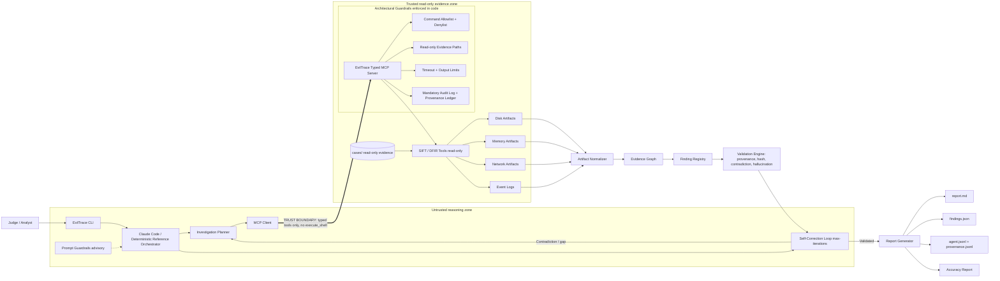

# EvilTrace Architecture

EvilTrace is built around a strict **trust boundary** between autonomous reasoning and
forensic evidence access. The LLM/orchestration layer is treated as an *untrusted reasoning
zone*; all evidence access crosses into a *trusted, read-only evidence zone* through a typed
MCP server that exposes only structured forensic functions — there is no `execute_shell` tool,
so the agent physically cannot run arbitrary or destructive commands.

## Trust Boundary

The double-lined edge `MCP Client ==> MCP Server` is the trust boundary. Everything to its
left (planning, self-correction, any LLM reasoning) is untrusted and cannot touch evidence
directly. Everything to its right runs in code with enforced guardrails and only ever reads
evidence. The boundary is **architectural, not advisory**: even if the model attempts a
destructive action, the MCP server exposes no tool to perform it, and the command runner
rejects any non-allowlisted or denied command before a subprocess starts.

## Two Execution Modes (one shared core)

Both modes share the same typed MCP tools, validators, evidence graph, and append-only audit
log:

1. **Deterministic reference orchestrator** (`eviltrace run`) — rule-based planning, tool
   execution, validation, and self-correction with **no LLM inference in the loop**. Fully
   reproducible; runs the bundled sample in seconds. Token usage is zero by construction.
2. **Claude Code headless** — Claude drives the same MCP server (`.claude/mcp.json`,
   `prompts/`); per-turn token usage is captured into the same logs.

## Architectural Guardrails (enforced in code)

- Typed MCP functions expose case, evidence, PCAP, disk, Windows, memory, graph, finding, and
  validation operations — and nothing else.
- Evidence paths are read-only by policy; writes are restricted to `artifacts/` and `docs/`
  (`GuardrailConfig.ensure_write_path`).
- Command execution is allowlisted and denied-pattern checked (`GuardrailConfig.validate_command`).
- Tool calls have timeouts and output-size limits.
- Every tool call emits JSONL audit events plus a `provenance.schema.json` record (command,
  exit code, duration, stdout/stderr hashes) in `artifacts/raw/provenance/<case>.provenance.jsonl`.
- Claude Code `PreToolUse` hooks independently block writes under `cases/`/`evidence/` and
  destructive Bash, and **fail closed** if `jq` is unavailable.

## Prompt Guardrails (advisory, secondary)

- The investigator prompt forbids guessing and overclaiming.
- Findings must be marked `confirmed`, `inferred`, `rejected`, or `needs_review`.
- Unsupported claims must be rejected or downgraded.
- Final reports must cite artifacts and audit IDs.

If the model ignores these prompt rules, the architectural layer still rejects the
write/command and the validation engine still rejects the unsupported finding — see
`docs/accuracy-report.md` section 7.

## Output Pipeline

The orchestrator writes durable outputs under `artifacts/`. Any final finding traces from
`findings.json` → an artifact → an `audit_id` → a tool-execution event in `agent.jsonl` and a
provenance record in `provenance.jsonl` → the original evidence SHA256. The evidence graph
(`artifacts/graphs/<case>.graph.json`) encodes the same chain as
`Finding ←SUPPORTS_FINDING— Artifact —PRODUCED_BY→ ToolExecution` and `Artifact —OBSERVED_IN→ EvidenceFile`.
